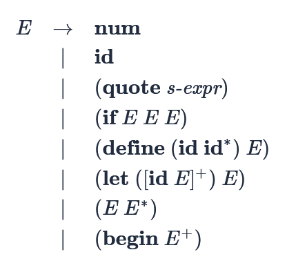

# CS 4850 Program 5: An Interpreter

# Overview
This project involves extending the interpreter from the previous assignment for user-defined functions, function calls of user-defined functions, a sequence of expression, and `let`-expressions in the Scheme programming language.

# Software installation
To install pytest, run the following command in a Terminal:

```
pip3 install pytest
```

# The Assignment
The Scheme programming language is a variant of Lisp that has static scoping. Scheme has an expression-oriented syntax that uses prefix notation. The following is a grammar for the subset of Scheme for which we will write an interpreter in this assignment.




For this assignment you only need to support additional Scheme functions the base environment: **cons, rest, first, null?, eq?, =, +, -, and \*.**
I have provided my solution to the first assignment in in the file `interp.py`. Your job is to write an interpreter for that list. The s-expression is guaranteed to follow the above grammar, so there will be no parse errors.
Note there will be a number of semantic error tests. You will need to figure out what is wrong, detect the errors in your code, and emit a meaningful error message that raises a `RuntimeError`.
